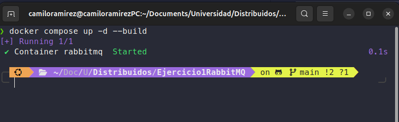

# Tareas distribuidas

### Integrantes:
 - Julian Bayona
 - Camilo Ramirez

 ---

  - evidencia de enrutamiento
 
 

 - Creación del servicio
 
 
 
 - Creación entorno virtual para instalar pika
 

 - Creación del worker
 

 - Creación del producer
 

 - Prueba de funcionamiento:
 Las tareas se reparten de manera equilibrada entre los workers
 

 - Tolerancia a fallos:
 Se terminó la ejecución del primer worker y la tarea no se perdió, se completó la tarea y los demas workers que quedaban realizaron las tareas faltantes.
 

## FLujo del programa
### 1. producer.py:

 - Conexión: crea una conexión `BlockingConnection` a RabbitMQ usando pika.`ConnectionParameters(...)`.

 - Declaración de cola: `channel.queue_declare(queue='tareas_distribuidas', durable=True)`.
    * `durable=True` asegura que la cola sobreviva a reinicios del RabbitMQ.

 - Persistencia del mensaje: al publicar se usa `properties=pika.BasicProperties(delivery_mode=2)` para pedir que el mensaje sea persistente.

 - Publicación: `basic_publish(exchange='', routing_key='tareas_distribuidas', body=..., properties=...)`.
    * Se usa el exchange por defecto (`''`) y la `routing_key` = nombre de la cola.

 - Cierre: cierra la conexión cuando termina.

### 2. worker.py:

1. Inicialización: `Worker(worker_id)` con contador `tasks_processed`.

2. Conexión y setup (en start()):
    - `BlockingConnection` al RabbitMQ (host, credenciales).
    - `channel.queue_declare(queue='tareas_distribuidas', durable=True)` — se asegura que el worker vea la misma cola durable.
    - `channel.basic_qos(prefetch_count=1)` — clave para equilibrio: el RabbitMQ no entregará más de 1 mensaje no-ack por consumidor.
    - `channel.basic_consume(queue=..., on_message_callback=self.callback, auto_ack=False)` — ack manual obligatorio.

3. Callback por cada mensaje (`callback(ch, method, properties, body)`):
    - Parseo JSON: `task_data = json.loads(body)`.
    - Llama a `process_task(task_data)` que simula el trabajo (`time.sleep(complexity)`) y actualiza `tasks_processed`.
    - Si todo OK -> `ch.basic_ack(delivery_tag=method.delivery_tag)` para confirmar eliminación del mensaje de la cola.
    - Si ocurre excepción -> `ch.basic_nack(delivery_tag=..., requeue=True)` para que el RabbitMQ reencole el mensaje y otro worker lo consuma.

4. Tolerancia a Ctrl+C y cierre:
    - Captura `KeyboardInterrupt`, imprime resumen (`tasks_processed`), llama a `channel.stop_consuming()` y `connection.close()`.

### 3. Distribución de tareas:

 - Gracias a `basic_qos(prefetch_count=1)`, cada worker recibe una tarea a la vez y no se sobrecarga.

 - RabbitMQ entrega las tareas de forma equitativa, evitando que un solo worker acapare todo el trabajo.

### 4. Flujo end-to-end paso a paso
1. Productor crea tarea `T1` -> publica como mensaje persistente en cola durable.

2. RabbitMQ recibe y guarda el mensaje en la cola.

3. RabbitMQ entrega `T1` a un worker disponible.

4. Worker ejecuta `process_task(T1)` (sleep simulando complejidad).
    - Si finaliza con éxito -> `basic_ack` -> RabbitMQ borra `T1` definitivamente.
    - Si lanza excepción o se cae -> sin `ack` -> RabbitMQ marca `T1` como **unacked**; al cerrarse la conexión del worker, el RabbitMQ reencola T1 y lo entrega a otro worker.

5. Repetir hasta agotar tareas.

6. Si RabbitMQ se reinicia y tanto la cola como los mensajes son durables/persistentes, las tareas pendientes permanecen y pueden ser procesadas al volver a levantar los workers.

## Mecanismos de fiabilidad y distribución
 - Persistencia de mensajes: Se usa `delivery_mode=2` para que las tareas no se pierdan aunque RabbitMQ se reinicie.

 - ACK manual: Un worker confirma explícitamente la finalización con `basic_ack()`. Si no lo hace, RabbitMQ reencola la tarea.

 - Prefetch (equidad): Con `prefetch_count=1`, RabbitMQ asegura que cada worker solo procese una tarea a la vez, balanceando la carga entre todos.

 - Tolerancia a fallos: Si un worker se cae durante el procesamiento, la tarea pendiente se reasigna automáticamente a otro worker disponible.